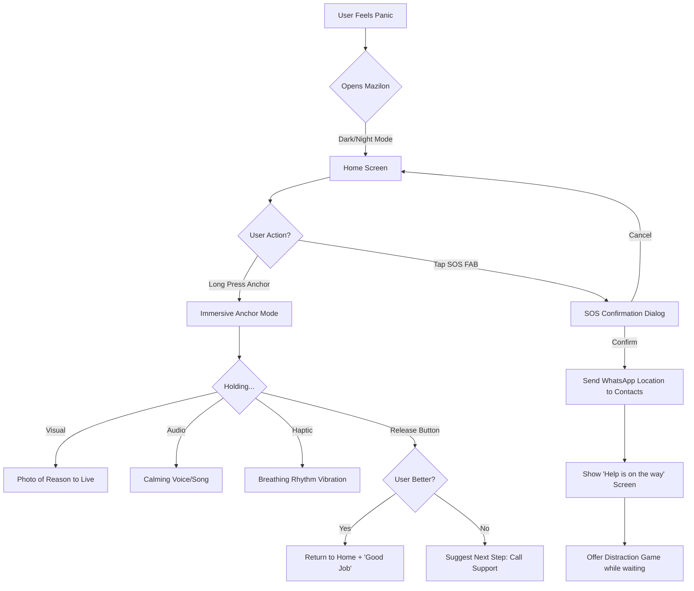

# UX Design Specification Mazilon

**Author:** Dekel
**Date:** 2026-02-03

---

<!-- UX design content will be appended sequentially through collaborative workflow steps -->

## Executive Summary

### Project Vision

Mazilon (Living Positively) is a mobile-first mental health support application designed to bridge the critical "treatment gap" for individuals experiencing distress, suicidal ideation, or severe depression. The app provides immediate, accessible, and judgment-free tools that serve as a safety net during crisis moments and as a therapeutic companion between professional care sessions. Unlike impersonal commercial alternatives, Mazilon creates a "Shomer Alay" (guardian) experience—a protective digital presence that validates users' experiences while providing practical coping mechanisms.

### Target Users

**Primary Audience**: Individuals in mental health distress who are:
- Stuck in the public psychiatric care waiting queue (months-long delays) or unable to afford private therapy
- Experiencing isolation due to stigma and shame around mental health
- Seeking immediate, practical tools to de-escalate personal crises before reaching emergency care
- Managing suicidal ideation, severe depression, or overwhelming anxiety

**Technical Proficiency**: Broad spectrum from tech-native younger users to older adults with limited digital literacy. Critically, users may be cognitively impaired during crisis states due to stress, depression, or panic—requiring ultra-low cognitive load design.

**Context of Use**:
- **Crisis Moments**: Late-night triggers, feeling unsafe, overwhelming distress (mobile-primary)
- **Daily Maintenance**: Routine check-ins, medication reminders, resilience-building practices
- **Therapy Adjunct**: Between-session tracking, safety plan management, therapeutic "homework"

### Key Design Challenges

1. **Crisis-State Design**: Users interact with the app during extreme cognitive impairment. Every feature must function under high stress with minimal mental effort—large touch targets, zero-ambiguity navigation, immediate feedback, and clear visual hierarchy.

2. **Trust Without Clinical Coldness**: Users are fleeing "bot fatigue" and robotic experiences from competitors like 7Cups. The interface must feel warm, human, and validating while maintaining professional credibility. Avoiding sterile medical aesthetics without sacrificing trustworthiness.

3. **The SOS Paradox**: The SOS alert system must be conspicuously accessible (one-tap reach during panic) without risk of accidental activation. Balancing urgency with intentionality in interaction design.

4. **Privacy + Urgency Balance**: Users need discretion due to stigma, yet must quickly share crisis states with trusted contacts. The UX must make vulnerability feel protected—clear consent controls, transparent data sharing, and discrete notifications.

5. **Localization Depth**: Israeli users require more than translation—cultural metaphors, linguistic nuances, and visual references that signal "this was made for me, not adapted from a Western template."

### Design Opportunities

1. **"Shomer Alay" (Guardian) Experience**: Position the entire app as a gentle, protective companion rather than a clinical tool or surveillance system. Visual language, micro-interactions, tone, and motion design can reinforce the emotional message: "You are not alone."

2. **Progressive Simplicity / Adaptive UI**: Unlike competitors with overwhelming "growth path" complexity, Mazilon can intelligently adapt interface density based on user state—minimal crisis-mode UI (SOS, immediate tools) expanding to fuller feature sets during calm periods.

3. **Israeli Cultural Resonance**: Opportunity to create the first truly Israeli mental health app—using Hebrew linguistic patterns naturally, incorporating local support system structures (family-centric culture), and reflecting lived experience of Israeli mental health stigma.

4. **Therapeutic Continuity Bridge**: Design the UX to feel like an extension of professional care, not a replacement. Visual treatment of safety plans, progress tracking, and therapist-assigned tasks can mirror clinical frameworks while remaining accessible to non-professionals.

## Core User Experience

### Defining Experience

Mazilon's core experience centers on a daily resilience-building loop rather than reactive crisis management. The primary user action is **daily check-ins and micro-practices**—small self-care tasks like relaxation exercises, gratitude journaling, and exposure to positive neurochemical triggers. This "gym for the soul" approach builds trust and self-efficacy through routine practice, ensuring users will rely on the app during actual crisis moments.

**The Core Loop:**
1. **Trigger**: User receives gentle reminder or feels distress
2. **Action**: Performs quick self-check or selects personalized tool (breathing exercise, "My Anchor," grounding technique)
3. **Reward**: Experiences immediate relief and renewed sense of control (Agency)

The absolutely critical interaction is **Safety Plan Activation / SOS**. During crisis states characterized by "tunnel vision" (dissociative or psychotic episodes), users cannot search for contacts or remember strategies. The app must serve emergency contacts (SPI Steps 3-5) and internal calming strategies (SPI Step 2) with a single tap. Failure here is life-threatening.

**Effortless Core Actions:**
- **SOS Button**: One-tap access from any screen, conspicuously accessible without accidental activation risk
- **"My Anchor"**: Immediate access to personal reason for living (photo of loved one, empowering phrase)
- **"Save Me From Myself" (Distract Me)**: Instant transition to distracting content (simple game, calming video) to break rumination loops
- **Immediate Emotional Regulation**: Large-button access to grounding exercises ("Wonder Exercise") with minimal text, using audio/visual guidance instead of written instructions
- **Home Button**: Fixed, clear "return to safe shore" navigation regardless of menu depth

### Platform Strategy

**Mobile-First with Strategic Web Support:**

**Primary Platform - Native Mobile App:**
- Crisis happens anywhere; the tool must be pocket-accessible at all times
- iOS and Android both required (cross-platform framework like Flutter preferred)
- Support older devices and lower-end hardware—users in economic distress often have older phones
- Lightweight app optimized for performance on devices 2-3 years old

**Secondary Platform - Web Interface:**
- **Onboarding/Intake**: Initial questionnaires more comfortable on keyboard/large screen, improving completion rates
- **"Safety Net" Portal**: Family members, therapists, and trusted contacts access shared safety plans via secure browser link without downloading app
- No critical emergency features on web—this is administrative/planning context only

**Interaction Paradigm - Touch-Based with Forgiving Design:**
- During anxiety or emotional storms, fine motor skills deteriorate (trembling hands, sweating)
- **Fat Finger Design**: Critical buttons (SOS, grounding tools) must be large and clear, not requiring millimeter precision
- **Simple Gestures**: Scroll and tap preferred; avoid complex pinch, multi-finger drag, or precise interactions
- **Minimal Typing in Crisis**: Use selection from options (chips, cards) instead of text input during distress states

**Accessibility Requirements (WCAG 2.1 AA+):**
- **High Contrast & Dark Mode**: Essential for users with depression-related light sensitivity and reading difficulties
- **Screen Reader Support**: Full compatibility for blind and visually impaired users
- **Cognitive Accessibility**: Simple language, minimal text density, clear visual hierarchy
- **Localized for Israeli Context**: Hebrew linguistic patterns, cultural metaphors, family-centric support structures

**Offline-First Architecture (Life-Saving Requirement):**
- Crisis can occur in elevators, parking garages, remote areas, or when cellular data is depleted
- **Local Storage Critical Content**: Safety Plan, emergency contacts, grounding tool content (audio/text files) stored on device
- **Background Sync**: App syncs to cloud when connected, but no critical screen ever displays "connection error" or loading spinner
- **Graceful Degradation**: All crisis features work without internet; social/sharing features queue for later sync

**Device Capability Leverage:**
- **Biometric Authentication**: Fingerprint/Face ID for privacy—removes barrier of typing password in public (bus, waiting room)
- **Haptic Feedback**: Gentle vibration for breathing exercise guidance (vibrate on inhale, pause, vibrate on exhale) to focus attention on body rather than intrusive thoughts
- **Push Notifications**: Gentle daily reminders and encouraging messages, with full user control over frequency to avoid pressure
- **Native Dialer Integration**: "Call for help" button opens phone dialer immediately with zero intermediate steps

### Effortless Interactions

**Zero-Thought Actions (Instinctive Access):**
1. **"My Anchor" One-Tap**: Personal reason to live accessible from home screen in single tap
2. **SOS Alert**: Conspicuous but protected from accidental activation
3. **Distraction Tools**: Immediate access to content that breaks rumination cycles
4. **Grounding Exercises**: Start breathing or sensory techniques without navigation
5. **Home/Reset**: Return to safe starting point from any menu depth

**Friction Elimination (Learning from 7Cups Failures):**
- **No Bot/Human Confusion**: If AI tools exist, clearly label as assistive technology, never masquerading as human connection
- **Tunneling Over Choice Paralysis**: Offer one clear, personalized suggestion per moment rather than 10 overwhelming options (avoiding "Growth Path" cognitive overload)
- **Seamless Continuity**: Transitions between self-tools and human support maintain context—user never "starts over" explaining their state
- **Password-Less Emergency Access**: Safety Plan and SOS features accessible without authentication barriers, even if user forgot credentials
- **Crisis-Mode Onboarding Skip**: First-screen option "I need help now" bypasses intake and leads directly to immediate tools; questionnaires completed later during calm
- **Algorithmic Matching**: "Talk to me" button connects user automatically to support—no browsing, filtering, or searching through listener profiles

**Automatic Behind-the-Scenes Intelligence:**
- **Aggressive Auto-Save**: Every character in journal entries saved in real-time—zero risk of data loss from crashes
- **Pattern Recognition**: If user accesses app at 3 AM multiple consecutive nights, system gently suggests sleep plan review the next morning
- **Automatic Offline Caching**: Safety Plan downloads to device immediately upon creation without manual save action
- **Pre-Loaded Crisis Content**: Calming videos, grounding audio, and distraction games cached locally for instant access

**Personalization That Creates "Being Seen":**
- System remembers which tools worked previously: "Good evening [name], I remember this exercise helped you last time you felt this way"
- Context-aware suggestions: "I noticed you didn't sleep well last night, maybe try a gentle morning start?"
- Visual, personal Safety Plans with contact photos instead of dry text lists—familiar faces trigger immediate calming response

**Empathetic Micro-Interactions:**
- Replacing "Saved" with "Thank you for sharing. This step matters."
- Celebrating just opening the app: "Happy you chose to be here with us"
- Reflecting de-escalation success: "You succeeded in lowering your anxiety level yourself"

### Critical Success Moments

**The "Aha!" Moment (Realization of "This is Better"):**
1. **Safety Plan Visualization**: When the SPI transforms from clinical form to personal inspiration board—seeing photo of their child, dog, or meaningful quote under "Reasons to Live." This is the moment the tool becomes theirs, not the system's.
2. **Context Intelligence**: First time the app demonstrates "Being Seen"—suggesting a gentle morning after detecting poor sleep, offering the specific tool that worked before. Users realize this isn't generic automation.

**Moments of Accomplishment (Self-Efficacy Building):**
1. **Micro-De-escalation Victory**: User reports distress level 9, completes grounding exercise, reports level 7. System reflects: "You succeeded in lowering anxiety yourself"—building confidence in self-regulation
2. **Celebrating Showing Up**: For someone in clinical depression, opening the app instead of staying in bed is heroic. Gentle acknowledgment: "We're glad you're here with us"
3. **Completing Safety Plan Chunks**: Breaking SPI creation into small, rewarded steps rather than overwhelming single form

**Catastrophic Failure Points (What We Must Never Break):**
1. **Session Timeout During Crisis**: User in fragile moment opens app and faces "Re-enter password" screen—causes phone-throwing despair. System must detect distress patterns and allow limited access without barriers.
2. **Invalidating Responses**: User writes "I want to die" in journal; bad bot responds with unrelated emoji or error message. This recreates isolation and feeling unheard—catastrophic trust violation.
3. **SOS System Failure**: Alert doesn't send, contacts don't load, app crashes during crisis—life-threatening outcomes.

**Make-or-Break User Flows:**
1. **Safety Plan Creation Journey**: Most users abandon here due to cognitive demand. Must use progressive disclosure (chunking) with encouragement between steps. If incomplete, we have no safety net for crisis.
2. **Alone→Together Transition**: When user shares Safety Plan with Trust Contact. If link breaks or contact doesn't understand what they received, the vulnerable act of reaching out becomes another rejection.
3. **First Crisis Experience**: If the app fails during a user's first real crisis moment, we lose them forever and potentially endanger them.

**First-Time User Success (Trust Earned in 60 Seconds):**
1. **Immediate Physiological Relief**: Prominent first-screen button: "I need calm now" → breathing animation or calming sound. If heart rate drops noticeably within 60 seconds, we earn belief through felt experience.
2. **Privacy Assurance Upfront**: Clear message addressing stigma fear: "What you write here stays on your phone only, unless you choose to share." Users need to know they control their data before vulnerability is possible.
3. **Quick Win Without Tutorial**: Users arrive in pain—no time for onboarding. First interaction must create tangible relief, not education.

### Experience Principles

These principles guide all UX decisions for Mazilon:

1. **"Shomer Alay" (Guardian Presence)**: The app is not a tool to be used, but a protective companion that remains present. Every interaction—from personalized context-awareness to empathetic micro-copy to visual warmth—reinforces the emotional message: "You are not alone." The design language, motion, and tone create a sense of gentle protection rather than clinical surveillance.

2. **Crisis-First Design**: All critical features (SOS, grounding tools, Safety Plan, "My Anchor") must function flawlessly under extreme cognitive impairment. This means: one-tap access, large touch targets, minimal/zero text, no authentication barriers, offline functionality, and intelligent detection of distress patterns to remove friction. The app must work when the user is at their worst, not just their best.

3. **Strength-Based Validation**: Every action—from opening the app to completing a breathing exercise to lowering distress from 9 to 7—is acknowledged as meaningful progress. The system celebrates micro-successes and validates vulnerability without sterile clinical distance. Design avoids pathologizing language and instead reinforces agency and self-efficacy.

4. **Progressive Simplicity (Tunneling)**: Rather than overwhelming with choice paralysis, the app offers one clear, personalized suggestion at each moment based on user state and history. Crisis mode displays minimal UI with only essential tools; calm periods progressively reveal fuller feature sets. This adaptive interface density prevents the "Growth Path" confusion plaguing competitors.

5. **Trust Through Transparency**: Users maintain complete control over their data and understand what's shared with whom. Safety Plans show familiar faces (contact photos) rather than sterile lists. The transition from self-help to human support maintains continuity without forcing users to re-explain their state. Privacy and autonomy are foundational, not afterthoughts.

## Desired Emotional Response

### Primary Emotional Goals

Mazilon's emotional design centers on three foundational feelings that determine success or failure:

1. **Trust (Radical Trust)**: The absolute foundation. Without trust, there is no use. Users arrive skeptical about mental health apps due to privacy concerns and commercialization of distress. Trust is built through:
   - **Transparency**: Immediate clarification that information is stored locally on device, not in public cloud
   - **Authenticity**: Absolute avoidance of fake empathy. If it's a bot, label it clearly as assistive technology. Never mimic human connection robotically (the lesson from 7Cups' "Noni" failure)
   - **Reliability**: Delivering exactly what's promised, every single time

2. **Agency/Competence ("I Have the Steering Wheel")**: The transition from helplessness to action. During suicidal crisis, users feel utterly powerless. Mazilon doesn't passively "rescue" like an ambulance—it provides tools for self-rescue, like a life preserver they grasp themselves. When users click a button and their breathing calms, they must feel: "**I did this**." This is true empowerment.

3. **Validation & Dignity**: The feeling that "my pain is legitimate and understood" and "I am a person of value, even when I'm suffering." People in extreme mental states often experience humiliation in hospital systems or with family. The app must convey deep respect through:
   - Offering choice, never commands ("What would help you right now?" not "Do this now!")
   - Mature data reflection instead of patronizing badges ("This is the third time this week you chose breathing instead of self-harm. That's a brave choice.")
   - Respecting the user's pace—no pressure, no forced progression

### Emotional Journey Mapping

**First Encounter (Discovery & Download): "I'm in the Right Place"**
- **Context**: User downloads Mazilon during a difficult moment—heart racing, thoughts chaotic, walking through an emotional storm
- **Desired Feeling**: **Relief (Exhale)** - Like entering a warm, quiet lobby after walking in a storm
- **Design Approach**: Minimalist design, calming colors, first message: "You don't need to do anything now except breathe. We'll hold the space for you."
- **Avoid**: Curiosity (requires too much energy), Joy (feels fake and invalidating)

**During Core Action: "I Am Capable"**
- **Context**: User activates a tool—breathing exercise, views Safety Plan, accesses "My Anchor"
- **Desired Feeling**: **Competence/Agency** - The opposite of suicidal helplessness. User feels their action is affecting their internal reality
- **Design Approach**: Measurable physiological feedback (heart rate dropping, anxiety level changing), "You did this" attribution, visual Safety Plans with contact photos that elicit warm emotions melting the emotional freeze
- **Avoid**: Passive "we fixed you" language, abstract tools without tangible impact

**Completing Routine Task (Daily Check-in): "I Invested in Myself"**
- **Context**: User completes daily check-in during a calm period
- **Desired Feeling**: **Self-Appreciation** - Not "I completed a task" but "I deposited money in my mental resilience bank"
- **Design Approach**: Feeling like after a good workout or warm shower—cleanliness and internal order. User recognizes they're building the "muscle" that will serve them in the next crisis
- **Avoid**: Transactional task completion, pressure to perform, guilt if skipped

**When Something Goes Wrong (Failure State): "It's the Device, Not Me"**
- **Context**: App crashes, tool doesn't help, technical glitch during vulnerable moment
- **Desired Feeling**: **Acceptance and Support (Absolved)** - Failure attributed to system, not self
- **Design Approach**: Super-human error messages: "We apologize, the technology got tired for a moment. This says nothing about you. Here's a direct number for human response if you want." Immediately offer human alternative
- **Critical Avoid**: Frustration directed inward ("Nothing helps me, I'm a lost case")—this is catastrophic

**Returning to Use (Retention): "Coming Home"**
- **Context**: Second, third, ongoing use—building the habit
- **Desired Feeling**: **Ownership & Intimacy** - "This is my personal sanctuary" not "a service I rent"
- **Design Approach**: User's most authentic things live here (personal photos, songs, journal). The only place they don't need to pretend. Habit built on need for privacy and internal truth, not annoying notifications
- **Avoid**: Gamification (points/medals feel childish or pressuring), guilt-based retention tactics

### Micro-Emotions

**Confidence vs. Confusion:**
- **Target**: 100% Confidence, zero room for interpretation
- **Why Critical**: In crisis, every second of confusion ("Where do I click?" "What does this do?") translates to growing anxiety
- **Design Implementation**: **Tunneling**—don't show 5 options, show one clear suggestion: "You want to calm down now?" Navigation feels like strong, stable safety railing, never a maze

**Trust vs. Skepticism:**
- **Target**: Radical trust built through transparency and authenticity
- **Why Critical**: Foundation for all use; without trust, there is no engagement
- **Design Implementation**: Local storage messaging upfront, clear AI vs. human labeling, delivering exactly what's promised

**Excitement vs. Anxiety:**
- **Target**: **Calmness and "Gentle Vitality"** (not high-arousal excitement that can trigger anxiety in post-trauma states)
- **Why Critical**: Excitement energy can be misinterpreted as anxiety; users need "air to breathe"
- **Design Implementation**: Visually "quiet" design, soft colors, gentle sunrise (not party), careful optimism

**Accomplishment vs. Frustration:**
- **Target**: **Validation, not medals** (patronizing accomplishment can insult someone considering their life)
- **Why Critical**: Builds self-efficacy without infantilizing
- **Design Implementation**: Data reflection showing pattern recognition: "We noticed this is the third time you chose breathing over self-harm. That's brave." Creates mature sense of competence

**Delight vs. Satisfaction:**
- **Target**: **Resonance and Relief** (precision, not surprise)
- **Why Critical**: In mental crisis, we don't want surprising delights—we want exactly what's needed
- **Design Implementation**: The moment user reads/hears something and feels: "That's exactly what I needed." Deeper than satisfaction—it's accuracy

**Belonging vs. Isolation:**
- **Target**: **Quiet Solidarity** ("Alone but together")
- **Why Critical**: Creates belonging without forcing exposing community features
- **Design Implementation**: Anonymous statistics ("Right now, 300 people are breathing with you"), curated peer quotes (anonymous, hopeful: "I was there, it gets better"), no forced profiles or social features

**Dignity (Additional Critical Micro-Emotion):**
- **Target**: Respect and autonomy preserved even in extreme states
- **Why Critical**: Foundation for recovery (Patricia Deegan's work)
- **Design Implementation**: Choice-based language ("What would help you?"), respecting user's pace, never commanding ("Do this now!"), conveying "I am valuable even when suffering"

### Design Implications

**For Trust (Foundation Layer):**
- Transparent local storage messaging displayed upfront
- Clear labeling: AI tools marked as assistive technology, human connection clearly distinguished
- No fake empathy or robotic mimicry of human warmth
- Technical reliability—deliver exactly what's promised every time
- **Anti-Pattern to Avoid**: "Locked Door"—never require re-login or updates during SOS access. Use graceful degradation to open critical tools immediately even without authentication

**For Agency/Competence (Tools Layer):**
- Tools that create measurable physiological change (breathing exercises with haptic feedback)
- Visual/audio feedback showing real-time impact (anxiety level dropping, heart rate slowing)
- "You did this" attribution language, never "we fixed you"
- One-tap access to "My Anchor" (personal photos/quotes as transitional objects)
- **Anti-Pattern to Avoid**: "Attention Traps"—no infinite scroll or auto-recommendations. Every list has clear end. Return control of when to stop to the user

**For Validation & Dignity (Content Layer):**
- Data reflection instead of childish badges: "Third time choosing breathing—that's brave"
- Offering choice, not commands: "What would help you right now?"
- Respecting user's pace—no pressure, no guilt for pauses
- Mature, containing language: "It's okay that it hurts now, let's breathe together"
- **Anti-Pattern to Avoid**: "Toxic Positivity"—no overly bright colors, forced happiness, or "smile and it'll pass" messages. Use calm, monochromatic palette and validating language

**For Confidence (Navigation Layer):**
- Tunneling: One clear suggestion per moment based on user state
- Large, unambiguous buttons (Fat Finger Design for trembling hands)
- Fixed navigation patterns—always clear path "home"
- **Anti-Pattern to Avoid**: "Dead Ends"—always have Plan B. If "Call therapist" gets no answer, immediately offer alternatives (exercise, text ER"N, song). Never leave empty screen or dry error message

**For Quiet Solidarity (Connection Layer):**
- Anonymous statistics creating sense of tribe: "300 people breathing with you now"
- Curated peer quotes (anonymous, hope-focused)
- No forced community features, profiles, or exposing social elements
- "Alone but together" messaging

**For Intimacy & Ownership (Personalization Layer):**
- Ability to upload personal photos as backgrounds (not generic stock photos)
- Choose "anchor song" that auto-plays in emergency mode
- Option to rename app for privacy
- Result: Device becomes calming transitional object—"This is mine, not a rented service"

**For Continuity of Memory (Context Layer):**
- Home screen adapts by time of day (soft "good night" at bedtime)
- Visual history of actions: "On Tuesday you felt like this, and did this"
- System remembers which tools worked: "This exercise helped you last time"
- Result: Feeling that "someone" remembers me even when dissociation breaks my memory

### Emotional Design Principles

These principles translate abstract recovery concepts into actionable product guidelines:

1. **"I Have the Steering Wheel" (Agency over Rescue)**: Design for self-rescue, not passive saving. Every feature reinforces: "You have power over your internal state." Tools provide measurable impact users can attribute to their own actions.

2. **"The Warm Lobby After the Storm" (Relief over Excitement)**: First contact creates exhale relief, not high-energy excitement. Minimalist, visually quiet design with calming colors. Gentle vitality, not party atmosphere.

3. **"Furnish Your Own Room" (Ownership over Service)**: App becomes personal sanctuary users build and nurture. Personal photos, chosen songs, private journal. Feels like entering favorite room and locking door—protected from external world.

4. **"Quiet Solidarity" (Belonging without Exposure)**: Create tribal feeling without forced community. Anonymous peer presence ("300 breathing with you"), hopeful quotes, no profiles or social pressure.

5. **"It's the Device, Not Me" (External Attribution for Failure)**: When things break, attribute failure to system and immediately offer human alternative. Never leave user in empty error state feeling abandoned.

6. **"Data Reflection over Medals" (Mature Validation)**: Show patterns, not points. "Third time choosing breathing over self-harm—that's brave" builds real self-efficacy. No childish gamification that insults someone considering their life.

7. **"Always Have a Plan B" (No Dead Ends)**: Every potential failure point has immediate alternative. Call not answered? Here are 3 other options. Never leave user in free fall without safety net.

8. **"100% Confidence, 0% Confusion" (Tunneling over Choice Paralysis)**: One clear suggestion per moment. Strong, stable navigation railing. Every second of confusion breeds anxiety in crisis states.

## UX Pattern Analysis & Inspiration

### Inspiring Products Analysis

*   **Spotify (Emotional Regulation Master)**
    *   **Core Value**: People use music to regulate emotions; Spotify facilitates this instant shift.
    *   **Key UX Strengths**:
        *   **Dark Mode Default**: Creates an intimate, non-dazzling environment perfect for late-night distress.
        *   **Giant Touch Targets**: The Green Play Button is unmissable—a primary interaction anchor.
        *   **"Made for You"**: Feeling understood ("The app knows me").
    *   **Application to Mazilon**: "My Anchor" screen should function like a media player. Big image of loved one + Giant Play button for voice note/song. One tap to change the emotional atmosphere.

*   **Headspace (Intimidation Reduction)**
    *   **Core Value**: Makes "treatment" (meditation) friendly and non-threatening.
    *   **Key UX Strengths**:
        *   **Metaphors over Instructions**: Breathing via an expanding blob, not a stressful digital timer.
        *   **Human Warmth**: Voice-led onboarding, not text-heavy forms.
        *   **Soft UI**: Rounded corners, pastels, absolutely zero "medical" aesthetics.
    *   **Application to Mazilon**: Use soft animations for breathing exercises. Avoid clinical language. Ensure the interface feels like a "hand-holding" experience.

*   **Candy Crush / Casual Games (The Ultimate Distractor)**
    *   **Core Value**: Immediate "Zero Friction" entry into a flow state that blocks rumination (SPI Step 2).
    *   **Key UX Strengths**:
        *   **Zero Friction**: Opens instantly, playing within seconds.
        *   **Feedback Loops**: Visual/audio rewards for small actions.
        *   **Cognitive Sweet Spot**: Requires enough focus to block intrusive thoughts, but not enough to cause frustration.
    *   **Application to Mazilon**: A "Clear My Head" button that launches a simple, non-competitive tactile game (bubble popping, color sorting) to break dissociation/panic loops.

### Transferable UX Patterns

**Visual Patterns:**
*   **Dark Mode by Default**: Essential for the specific context of use (often late night, in bed, hiding under covers).
*   **Media Player Metaphor**: Using the familiar "Cover Art + Play Button" layout for emotional anchors rather than a "Profile + File" layout.
*   **Soft UI**: Rounded corners, gentle motion, and character-driven (or abstract shape-driven) guidance to lower cortisol.

**Interaction Patterns:**
*   **The "Giant Green Button"**: A single, oversized primary action on key screens that requires no precision to hit (Fat Finger design).
*   **Zero-Friction Distraction**: Immediate access to low-stakes cognitive tasks.
*   **Audio-Visual Feedback**: Using sound and color bursts to reward "micro-steps" of self-care, validating the user's effort.

### Anti-Patterns to Avoid

*   **The "Medical Chart" Aesthetic**: Sterile white backgrounds, small text, standard form fields, and "clinical" vibes.
*   **The "Digital Stopwatch"**: Using numbers/timers for breathing or grounding exercises (induces performance anxiety) instead of organic animation.
*   **Text-Heavy Onboarding**: Relying on reading when the user's cognitive capacity is compromised.
*   **High-Friction Start**: Any splash screen or loading sequence that delays the "relief" (music/game/help) by more than 2 seconds.
*   **Blue Light/Glare**: Interfaces that are too bright for dark environments, disrupting sleep hygiene further.

### Design Inspiration Strategy

**What to Adopt:**
*   **Spotify's "Now Playing" Layout**: For the "My Anchor" feature.
*   **Headspace's "Sleep Mode" Logic**: Interface that adapts to be gentler at night.

**What to Adapt:**
*   **Game Mechanics**: Strip the "addiction/monetization" out of Candy Crush mechanics and keep the "Flow State/Distraction" mechanics for the "Save Me From Myself" tool.
*   **Algorithm "Magic"**: Instead of "Discover Weekly," use "Remembered Remedies"—surfacing tools that worked previously.

**What to Avoid:**
*   **Gamification for Status**: No leaderboards or competitive badges. The "win" is feeling better, not beating others.

## Design System Foundation

### 1.1 Design System Choice

**Material Design 3 (M3) with Aggressive Theme Override**

We are choosing the established **Material Design 3** system as our technical foundation but committing to a heavy visual customization strategy to strip away the "Google Utility" look and replace it with a "Therapeutic Softness."

### Rationale for Selection

1.  **Accessibility First (Critical Safety)**: M3 enforces minimum touch targets (48dp) and accessible contrast ratios out of the box. For a user in a panic attack with trembling hands and blurred vision, these constraints are not just "nice to have"—they are safety features. We don't need to "remember" to make buttons pressable; the system ensures it.
2.  **Zero Cognitive Load**: Users intuitively understand M3 patterns (Navigation Rail, Bottom Sheet, FAB). In a crisis, users lose the ability to learn new interfaces. Using standard patterns reduces friction to zero.
3.  **Development Velocity**: As a solo developer project, leveraging Flutter's native M3 widget library allows focus on *logic* (SOS reliability) rather than *pixels* (building custom sliders).

### Implementation Approach

*   **Framework**: Flutter Native Material 3.
*   **Theming Strategy**: Global `ThemeData` override. We will not style individual widgets; we will define a rigid Design System in the app's root theme that cascades everywhere.
*   **Component Restriction**: We will stick to standard M3 components (Cards, FABs, NavigationBars) to maintain consistency, but alter their *properties* (Shape, Color, Elevation).

### Customization Strategy (The "Mazilon" Feel)

To prevent the "Gmail look," we apply three strict rules:

1.  **Shape: "Super Rounded" (Safety)**
    *   **Rule**: All cards, dialogs, and sheets use `BorderRadius.circular(16-24)`.
    *   **Psychology**: Sharp corners feel clinical/industrial. Round shapes feel organic, safe, and containing—mirroring the "holding environment" of therapy.

2.  **Color: "Functional Pastel" (Calm)**
    *   **Rule**: No pure `#FFFFFF` white. Backgrounds are Warm Off-White (`#F8F9FA`) or Deep Calm Blue in Dark Mode.
    *   **System**: Use M3's "Surface Tones" to create depth/hierarchy without using harsh, aggressive drop shadows.

3.  **The FAB: "The Beating Heart"**
    *   **Role Change**: The Floating Action Button is not for "Creation" (New Email), it is for "Salvation" (SOS/Anchor).
    *   **Placement**: Centered on the Bottom Navigation Bar (Docked).
    *   **Style**: 20% larger than standard.
    *   **Color**: "Soft Alert" (Pastel Orange/Coral) - prominent enough to see instantly, but not "Red Siren" panic-inducing.

## 2. Core User Experience

### 2.1 Defining Experience

**The "Anchor Press" (Re-centering)**

Mazilon's defining experience is a **sensory safe room accessible via a single continuous gesture**. Unlike apps that demand input ("How are you feeling?"), Mazilon demands nothing but presence.

**The Definition**: "One long press that replaces internal chaos with your safest memory."

### 2.2 User Mental Model

*   **Current State**: The user is experiencing "Noise" (intrusive thoughts, panic) and wants it to stop *now*. They are seeking a "Painkiller" or a "Bunker," not a "Tool."
*   **Existing Behavior (Maladaptive)**: Self-harm (to feel something), Substance use (to feel nothing), Doomscrolling (to escape).
*   **The Gap**: Current solutions ask questions ("Rate your distress 1-10"). The crisis brain has zero resources to answer. This causes frustration and abandonment.
*   **The Mazilon Shift**: Bypassing cognition entirely. No choices, no reading. Direct access to the Limbic System (Emotion/Senses).

### 2.3 Success Criteria

1.  **Zero Latency**: The "Anchor" content (Image + Audio) must load instantly from local cache. Any loading spinner destroys the illusion of safety.
2.  **Physiological Shift**: The user must feel a measurable drop in distress within 30 seconds.
3.  **Haptic Sync**: The vibration must match the breathing rhythm (4-7-8 or 4-4-4) to physically guide the user's body without instruction.

### 2.4 Novel UX Patterns

**The "Holding On" Gesture (Long Press vs. Tap)**

*   **Standard Pattern**: Tap to toggle (Play/Pause).
*   **Mazilon Pattern**: **Long Press to Sustain**.
*   **Why**: A Tap is fleeting. A Long Press is an act of *grounding*. It mimics the physical act of "holding on" to a railing or a hand. It requires physical engagement.
*   **Behavior**:
    *   **Press & Hold**: The screen fills with the Anchor Image, Audio plays, Haptic breathing starts. The chaos is blocked out.
    *   **Release**: The content fades out gently (Safety Ramp-down), returning to the menu. The user is in control of the dose.

### 2.5 Experience Mechanics

**1. Initiation (The Trigger)**
*   User opens app in distress.
*   Home screen is dark/calm.
*   Center stage: A large, pulsing, circular "Anchor Button" (Soft UI).

**2. Interaction (The Anchor)**
*   **Action**: User places thumb on the button and holds.
*   **Visual**: UI elements fade away. The user's pre-selected "Reason for Living" photo expands to fill the screen (Immersive Mode).
*   **Audio**: The "Anchor Song" or "Voice Note" plays immediately.
*   **Haptic**: Phone vibrates in a slow, rhythmic breathing pattern (Inhale... Hold... Exhale).

**3. Feedback (The Shift)**
*   The user's body naturally syncs with the haptic rhythm.
*   The personal photo triggers positive emotional recall (Oxytocin).
*   The "noise" is replaced by the "signal" of the anchor.

**4. Completion (The Return)**
*   User lifts thumb when ready.
*   Audio/Image fade out slowly (2 seconds), not abruptly.
*   App gently asks (optional): "Better?" (Yes/No).

## Visual Design Foundation

### Color System

**Primary Palette (Lavender & Deep Blue)**
*   **Primary**: `0xFFA688F8` (Lavender) - Main brand color, used for primary actions and active states.
*   **On Primary**: `0xFFFFFFFF` (White) - Text on primary buttons.
*   **Secondary**: `0xFFE3C6FF` (Soft Lilac) - Used for background fills of active elements.
*   **Background**: `0xFFFAF8F8` (Warm Off-White) - Reduces glare compared to pure white.
*   **Surface**: `0xFFFFFFFF` (White) with elevation - For cards and dialogs.

**Semantic Colors**
*   **Text Primary**: `0xFF0F2851` (Deep Navy) - High contrast but softer than black.
*   **Text Secondary**: `0xFF9A9EB6` (Cool Gray) - For supporting text.
*   **Success/Safe**: `0xFF01B91E` (Green).
*   **Error/SOS**: `0xFFFFB4AB` (Pastel Coral) - *Proposed Soft Alert color*.

### Typography System

**Typeface**: **Rubik** (Rounded, humanist sans-serif).
*   **Why**: The rounded terminals of Rubik perfectly match the "Super Rounded" UI shapes, creating a subconscious feeling of softness and safety.

**Type Scale (Responsive)**
*   **Display**: 32sp (Bold) - For "My Anchor" and key emotional words.
*   **Headline**: 24sp (Medium) - Page titles.
*   **Body Large**: 18sp (Regular) - Standard reading text (larger than standard 16sp for tired eyes).
*   **Button**: 16sp (Bold) - Action labels.

### Spacing & Layout Foundation

**Shape System (Super Rounded)**
*   **Standard Radius**: **20dp** (derived from existing buttons).
*   **Card Radius**: **24dp** (for larger containers).
*   **Input Radius**: **16dp**.

**Spacing System (8pt Grid)**
*   **Base Unit**: 8dp.
*   **Padding**:
    *   XS: 4dp
    *   S: 8dp
    *   M: 16dp (Standard container padding)
    *   L: 24dp (Section separation)
    *   XL: 32dp (Bottom safe areas)

### Accessibility Considerations

*   **Touch Targets**: Minimum 48x48dp for all interactive elements (enforced by M3).
*   **Contrast**: `0xFF0F2851` (Navy) on `0xFFFAF8F8` (Off-white) exceeds AAA contrast ratio.
*   **Fat Finger Safe**: Spacing between distinct interactive elements must be at least 16dp to prevent accidental clicks.

## Design Direction Decision

### Design Directions Explored

We explored 6 distinct visual directions ranging from "Standard App" to "Immersive Sanctuary." The key tension was between *utility* (finding tools quickly) and *immersion* (feeling safe).

### Chosen Direction

**Hybrid Direction: "The Gentle Companion" (Direction 1) + "Sensory Anchor" (Direction 2)**

We are proceeding with **Direction 1** as the primary UI framework but integrating the specific **"Anchor Press" interaction** from Direction 2 as a central feature.

### Design Rationale

1.  **Trust & Familiarity**: Direction 1 looks like a professional, reliable tool. For users wary of "woo-woo" wellness apps, this standard Material 3 aesthetic (softened) builds immediate credibility.
2.  **Cognitive Accessibility**: The clear information hierarchy (Header -> Status -> Cards) is easiest to process when stressed.
3.  **Development Velocity**: This direction is closest to native Flutter Material 3, allowing the solo developer to move fast without fighting the framework (unlike Neumorphism).

### Implementation Approach

*   **Light Theme (Default)**: Warm Off-White backgrounds (`#FAF8F8`) with Lavender accents, exactly as shown in Direction 1.
*   **Dark Theme (Crisis Mode)**: Deep Blue/OLED Black backgrounds (from Direction 5) to prevent glare during late-night use.
*   **The "Anchor"**: Instead of just a static card, the "Daily Anchor" area will support the **Long Press** gesture we defined in the Core Experience, transitioning the screen into the immersive mode from Direction 2.

## User Journey Flows

### 1. The Crisis Pivot (SOS/Anchor)

This is the "Red Button" flow. The goal is to move the user from High Arousal (Panic) to Low Arousal (Calm) with zero friction.



### 2. Safety Plan Creation (Chunked Onboarding)

Users in distress cannot fill out long forms. This flow breaks the Safety Plan (SPI) into "Micro-Tasks" spread over multiple sessions.

```mermaid
graph TD
    A[First Open] --> B[Welcome / Trust Statement]
    B --> C{Immediate Crisis?}
    C -->|Yes| D[Skip Setup -> Go to Default Relief Tools]
    C -->|No| E[Start 'My Anchor' Setup]
    
    %% Step 1: The Hook
    E --> F[Upload 1 Photo (Reason to Live)]
    F --> G[Record/Select 1 Audio]
    G --> H[Preview Anchor Experience]
    H --> I[Save & Celebrate 'You have a Safe Space']
    
    %% Step 2: The Soft Ask (Later)
    I --> J[Home Screen]
    J -->|Next Session| K[Prompt: 'Add 1 Trusted Contact?']
    K -->|User Adds| L[Contact Added]
    K -->|User Skips| M[Remind Later (No Guilt)]
    
    %% Step 3: Progressive Profile Building
    L --> N[Unlock 'SOS Feature']
```

### 3. Daily Maintenance (The 10-Second Check-in)

The goal is to build a "bank of resilience" without feeling like a chore.

```mermaid
graph TD
    A[Notification: 'Time for you?'] --> B[Open App]
    B --> C[Daily Check-in Card]
    C --> D{How are you?}
    
    %% Choice 1: Good
    D -->|Good/Okay| E[Celebrate]
    E --> F[Suggest: Gratitude Journal (1 line)]
    
    %% Choice 2: Bad
    D -->|Not Good| G[Suggest: 1 Minute Breathing]
    G --> H[Start Breathing Animation]
    H --> I[Re-Assess: Better?]
    
    I -->|Yes| J[Log Success]
    I -->|No| K[Suggest: View Safety Plan]
```

### Journey Patterns

**Navigation Patterns:**
*   **The "Escape Hatch"**: Every screen (even modal dialogs) has a clear "Home" or "X" button. No user is ever trapped in a flow.
*   **The "Safe Return"**: After any intense activity (SOS, Anchor, Breathing), the user is gently returned to the Home Screen with a "Soft Landing" message ("Welcome back").

**Decision Patterns:**
*   **Binary Choice**: In crisis mode, never offer more than 2 options (e.g., "Yes/No", "Call/Text").
*   **Default to Safety**: If a user doesn't respond (timeout), the app assumes the safest state or keeps the current safe screen active.

**Feedback Patterns:**
*   **Validation**: Every completion (even just opening the app) is met with validating micro-copy ("Glad you're here").
*   **No Failure States**: If a user cancels a Safety Plan setup, the message is "We can do this later" (Permission), not "Setup Incomplete" (Failure).

### Flow Optimization Principles

1.  **"One Thumb, One Eye"**: All critical flows (Crisis Pivot) must be completable with one hand and partial attention (blurred vision/tears).
2.  **Zero-Typing Crisis**: The Crisis Pivot flow requires *zero* keyboard input. Only taps and holds.
3.  **Local First**: All content for the "Crisis Pivot" (Images, Audio) is pre-cached. The flow never waits for the network.

## Component Strategy

### Design System Components

We are leveraging **Flutter's Native Material 3 Library** for 80% of the UI to ensure speed and accessibility.
*   **Navigation**: `NavigationBar` (Bottom), `NavigationRail` (Tablet).
*   **Containers**: `Card` (Filled variant) with `BorderRadius.circular(24)`.
*   **Inputs**: `TextField` (Outlined) with custom rounded borders.
*   **Feedback**: `SnackBar` (for non-intrusive messages), `Dialog` (for critical confirmations).

### Custom Components

These components are unique to Mazilon and define its "Guardian" personality.

**1. The Anchor Button (Hero Component)**
*   **Purpose**: The primary interface for the "Crisis Pivot." A tangible "handrail" for the user to hold onto.
*   **Anatomy**: Large circular container (150-200dp), pulsing shadow, icon/text centered.
*   **Interaction**: **Long Press** (Hold).
*   **States**:
    *   *Idle*: Gently pulsing opacity (breathing metaphor).
    *   *Pressing*: Scale down slightly (tactile feedback), progress ring fills.
    *   *Active*: Expands to full screen.
*   **Accessibility**: Label "Hold for Anchor". Vibrate on press.

**2. The Breathing Widget**
*   **Purpose**: Visual guide for physiological regulation (4-7-8 breathing).
*   **Anatomy**: Abstract organic shape (Blob) or Circle. Soft gradient fill.
*   **Interaction**: Passive (Watch & Sync).
*   **States**:
    *   *Inhale*: Expands over 4 seconds.
    *   *Hold*: Static for 7 seconds.
    *   *Exhale*: Contracts over 8 seconds.
*   **Accessibility**: Must have accompanying Haptic feedback for eyes-closed usage.

**3. Safety Plan Card (Visual-First)**
*   **Purpose**: To display a "Reason for Living" or "Coping Strategy" without reading.
*   **Anatomy**: Aspect Ratio 1:1 or 4:3. Full-bleed image background. Gradient overlay for text legibility at bottom.
*   **Usage**: Grid lists in the Safety Plan view.

### Component Implementation Strategy

*   **Atomic Design**: We will build these as isolated Flutter Widgets (`AnchorButton.dart`, `BreathingCircle.dart`).
*   **Theme Inheritance**: Custom components will consume `Theme.of(context).colorScheme` so they automatically adapt to Light/Dark modes (Critical for "Night Mode Sanctuary").
*   **Haptic Integration**: The *Breathing Widget* and *Anchor Button* will have built-in calls to the Haptic Feedback service, ensuring the "feel" is never separated from the "look."

### Implementation Roadmap

**Phase 1: Crisis Core (The "Red Button")**
*   `AnchorButton` (Custom Gesture Detector + Animation).
*   `BreathingWidget` (AnimationController).
*   `ThemeWrapper` (The aggressive M3 override).

**Phase 2: Safety Plan Foundation**
*   `VisualCard` (For contacts/images).
*   `AudioPlayerCard` (For voice notes).
*   `ChunkedForm` (Stepper for onboarding).

**Phase 3: Daily Maintenance**
*   `CheckInCard` (Slider/Selector for mood).
*   `GratitudeInput` (Simple text field).

## UX Consistency Patterns

### Button Hierarchy

**1. The "Lifeline" (Primary)**
*   **Visual**: Large, Soft-Rounded, Pulsing Shadow.
*   **Usage**: Only for "Anchor Press", "SOS", and "Breathing Start".
*   **Action**: Instant or Long Press. Never disabled.

**2. The "Choice" (Secondary)**
*   **Visual**: Outlined or Soft Fill (Lavender/Lilac).
*   **Usage**: Navigation, Selection in Safety Plan.
*   **Action**: Standard Tap.

**3. The "Destructive" (Critical)**
*   **Visual**: Minimalist Text (no red buttons unless SOS).
*   **Usage**: Deleting a contact or entry.
*   **Action**: **Slide to Confirm** or **Complex Dialog**. (Friction is Safety).

### Feedback Patterns

**Sensory Over Semantic**
*   **Principle**: The body understands faster than the mind.
*   **Pattern**: Instead of a "Success!" popup, play a "Exhale" sound (descending chime) + Long Vibration.
*   **Text**: If text is needed, state facts ("3 minutes breathed") not judgments ("Good job!").

### Form Patterns (Empty States)

**"Never Empty, Always Scaffolding"**
*   **Problem**: An empty "Reasons to Live" list confirms hopelessness ("I have nothing").
*   **Solution**: **Hope Placeholders**.
*   **Example**:
    *   *Contacts*: "Who would you send a funny meme to? Tap to add."
    *   *Anchor*: Default beautiful sunset image with text "This space is held for your happy place."
*   **Result**: The app holds the space for the user until they are ready.

### Navigation Patterns

**"The Escape Hatch"**
*   **Rule**: Every modal, every immersive screen, every flow has a clear, always-visible exit.
*   **Visual**: A top-right "X" or a bottom "Home" bar.
*   **Why**: Feeling trapped increases panic. Knowing you can leave (Control) allows you to stay.

### Critical Action Patterns

**SOS Activation**
*   **Action**: Single Tap.
*   **Safety**: 3-Second "Cancel" Timer (Circular countdown).
*   **Why**: Removes friction for emergency, but prevents accidental police calls.

## Responsive Design & Accessibility

### Responsive Strategy

**Mobile First (Primary)**
Mazilon is designed primarily for the device in your pocket during a crisis.
*   **Orientation**: Portrait Locked (to prevent layout shifts during panic handling).
*   **Navigation**: Bottom Navigation Bar (Thumb zone).

**Tablet (Bedside Companion)**
*   **Use Case**: Night mode, breathing exercises, journaling in bed.
*   **Layout Shift**:
    *   `BottomNavigationBar` -> `NavigationRail` (Left side).
    *   Cards switch from List View (1 column) to Masonry Grid (2-3 columns).
    *   The "Anchor Button" remains centrally fixed and reachable.

**Desktop/Web (Safety Net Portal)**
*   **Use Case**: Administrative only. Used by trusted contacts/therapists to view shared plans, or by the user to type long journal entries when calm.
*   **Layout**: Centered "App Shell" container (max-width 480px) for app simulation OR Dashboard View for data review.

### Accessibility Strategy (Crisis-Grade)

We target **WCAG AAA** for all crisis flows because a panic attack mimics physical and cognitive disability.

**1. The "Tremor" Standard (Motor)**
*   **Touch Targets**: Minimum 64x64dp for primary actions (SOS, Anchor).
*   **Spacing**: Minimum 16dp separation between opposing actions (e.g., "Call" vs "Cancel").
*   **Forgiveness**: Gestures (swipes) must have high tolerance thresholds.

**2. The "Tunnel Vision" Standard (Visual/Cognitive)**
*   **Text Scaling**: Layouts must survive 200% text zoom without horizontal scrolling.
*   **Contrast**: Critical elements use 7:1 contrast (Navy on Off-White).
*   **No Timed Interactions**: Except for the "SOS Cancel" timer, no interface element disappears automatically.

**3. Screen Reader (Blind/Low Vision)**
*   **Semantics**: Every image (especially the Anchor Photo) must have a user-defined description field ("Photo of my dog, Rex") so the screen reader can "speak" the anchor.
*   **Status Announcements**: Changes in state ("Breathing started") must be announced (`SemanticsService.announce`).

### Testing Strategy

**The "Crisis Simulation" Protocol**
Developers must test critical flows under simulated impairment:
1.  **The Blur Test**: Set screen brightness to 10% or wear blurry glasses to simulate tears/disorientation. Can you find the Anchor?
2.  **The Shake Test**: Attempt to activate SOS while physically shaking the device.
3.  **The One-Hand Test**: Complete the entire "Crisis Pivot" flow using only the non-dominant thumb.

### Implementation Guidelines

*   **Flutter Semantics**: Wrap all custom painters (Breathing Widget) in `Semantics` widgets to expose value/state.
*   **Media Query Safety**: Use `LayoutBuilder` to make decisions, but ensure `FittedBox` or `Wrap` is used for text containers to prevent overflow errors.
*   **Haptic Fallback**: Always pair critical visual feedback with Haptics for users who cannot look at the screen.
